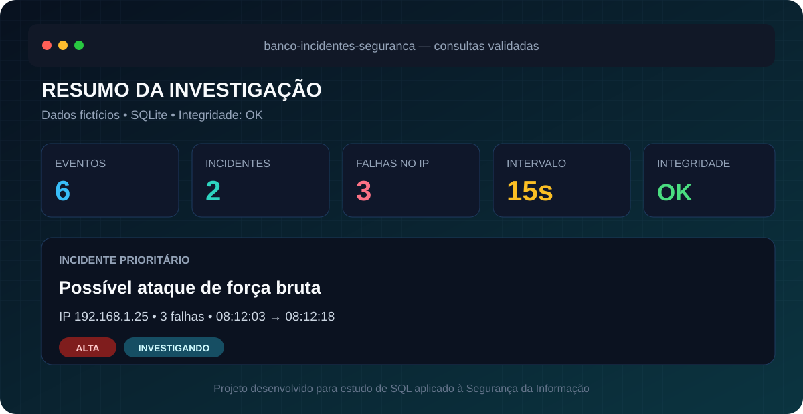

# Banco de Incidentes de Segurança

Projeto em **SQLite** para registrar eventos de autenticação, investigar endereços IP suspeitos e relacionar evidências a incidentes de segurança.



📘 **Material de estudo:** [baixe o guia didático completo em PDF](docs/guia-projeto-sql-incidentes.pdf), com explicações sobre modelagem, relacionamentos, consultas, resultados e como apresentar o projeto em uma entrevista.

## Problema investigado

Logs de autenticação isolados mostram apenas tentativas individuais. Este banco organiza usuários, endereços IP, eventos e incidentes para responder perguntas como:

- quais IPs acumularam falhas de autenticação;
- quanto tempo separou a primeira e a última tentativa;
- quais eventos servem como evidência de um incidente;
- quais incidentes exigem maior prioridade;
- quais usuários precisam de atenção ou acompanhamento.

Todos os registros são **fictícios** e foram criados exclusivamente para estudo.

## Modelagem

```text
usuarios 1 ─────── N eventos N ─────── 1 enderecos_ip
                         │
                         N
                         │
                         N
                    incidentes

Ponte N:N: incidentes_eventos
```

| Tabela | Responsabilidade |
|---|---|
| `usuarios` | Pessoas associadas aos eventos de autenticação |
| `enderecos_ip` | IPs de origem e indicação de confiabilidade |
| `eventos` | Tentativas de autenticação com data, tipo e resultado |
| `incidentes` | Casos investigados, gravidade e status |
| `incidentes_eventos` | Relação muitos-para-muitos entre incidentes e evidências |

O esquema utiliza chaves primárias, chaves estrangeiras, `UNIQUE`, `NOT NULL`, `CHECK`, valores padrão e exclusão em cascata na tabela associativa.

## Consultas de investigação

O arquivo [`consultas.sql`](consultas.sql) contém cinco análises:

1. lista detalhada dos eventos com usuário e IP;
2. IPs com duas ou mais falhas de autenticação;
3. eventos associados a cada incidente;
4. resumo executivo por gravidade, status e período;
5. classificação do comportamento de autenticação por usuário.

Conceitos praticados: `INNER JOIN`, `LEFT JOIN`, `WHERE`, `GROUP BY`, `HAVING`, `COUNT`, `SUM`, `MIN`, `MAX`, `GROUP_CONCAT`, `CASE` e ordenação personalizada.

## Resultado principal

A massa de testes identifica o IP `192.168.1.25` com três falhas em 15 segundos. Os eventos são associados a um incidente de gravidade alta e status `INVESTIGANDO`.

| Indicador | Resultado |
|---|---|
| Usuários | 3 |
| Endereços IP | 3 |
| Eventos | 6 |
| Incidentes | 2 |
| Evidências relacionadas | 4 |
| Validação de integridade | `ok` |

## Como executar

Requer o [SQLite](https://www.sqlite.org/) disponível no terminal.

```powershell
sqlite3 incidentes.db ".read schema.sql"
sqlite3 incidentes.db ".read dados.sql"
sqlite3 -header -column incidentes.db ".read consultas.sql"
```

Ordem dos arquivos:

1. [`schema.sql`](schema.sql) cria as tabelas e restrições;
2. [`dados.sql`](dados.sql) adiciona os registros fictícios;
3. [`consultas.sql`](consultas.sql) executa as investigações.

Para reconstruir o banco, remova apenas o arquivo local `incidentes.db` e execute novamente os comandos na ordem acima.

## Validação

O projeto foi reconstruído do zero em um banco temporário e validado com:

```sql
PRAGMA integrity_check;
PRAGMA foreign_key_check;
```

Resultado: estrutura íntegra e nenhuma violação de chave estrangeira.

## Tecnologias

`SQLite` `SQL` `Modelagem relacional` `Análise de dados` `Segurança da Informação` `VS Code`

## Próximas evoluções

- criar uma visualização em Power BI;
- importar eventos a partir de arquivos de log;
- automatizar a criação de incidentes a partir de regras de detecção;
- integrar o banco ao projeto Python Security Log Analyzer.

